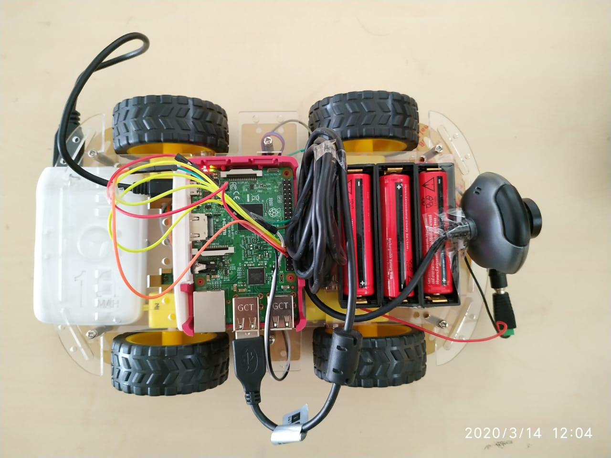

### GOBOT Autonomous Vehicular System For Item Delivery

>**Idea Behind Go-Bot**
        
        Product delivery is a repetitive and easy task that hardly faces complex problems and scenarios. Such an easy and set-method task can easily be
automated on a machine and using multiple sensors all the necessary information about the environment can be gathered even the ones which are not
possible for a human. So the idea is to develop an automation based driving module which can be easily trained and fine-tuned accordingly to be used for
delivery of products. The Solution developed is able to accurately detect traffic signs and act accordingly. Also, a Manual control module is implemented for
cases in which the ML model is not able to navigate the way and for training. This is an experimental prototype; this can be improved in many ways and new
protocols can be built on top of existing ones to further reduce the human dependencies and reform the existing methods for product deliveries.

>**Objective**
        
        Product Delivery systems are heavily reliant on human involvement in  transportation. Large scale organisations involved in product deliveries need to  rely on their delivery personnel for the tasks that involve even the shortest  distances. This leads to an excessive requirement of man-power for trivial tasks.  Also, in cases where human interaction is inadvisable, the human delivery  system can cause problems. 

        Hence, the idea is to eliminate the need for humans in the transportation  structure. This can be game-changing so we can implement it first from a  delivery perspective. Here, the drone or the bot can collect data from multiple  sensors and use it to process its next form of action to deliver the item from one  place to another. 

1. To build an Android Application which serves as an interface between  the vehicle and the user. 
2. To calibrate the GPS module and connect it to Pi so the user can get the  live location of the bot. 
3. To train the bot using a machine learning algorithm (YOLO) so that it  becomes self-reliant to detect its surroundings and take appropriate  moves/decisions. 
4. To provide a live feed of the camera to the user to monitor the bot's  movement. 
5. To navigate itself to the desired location without any human effort. 6. To deliver the items to the customer who ordered it. 
7. To ensure contact-less delivery owing to the safety of humans. 8. To reduce direct reliance on human resources for deliveries. 

>### Online Documentation Referred:
>>>>>>> facbbf28ca89ef49569e8d0aa8082269f9d45f2f
a. Java-http://pijava.com/SePiRemoteOne.html

b. Instructables(compass):https://www.instructables.com/id/Interfacing-Digital-Compass-HMC5883L-with-Raspberr/

c. Android-Libraries:
        https://developer.android.com/reference/android/graphics/BitmapFactory.Options?hl=en
        https://developers.google.com/maps/documentation/android-sdk/intro
        https://www.truiton.com/2015/03/stream-rtmp-live-android/
d. Firebase: https://firebase.google.com/products/ml-kit/

e. Tensorflow: https://www.tensorflow.org/guide

f. Google Maps API: https://developers.google.com/maps/documentation

g. Streaming(video):https://www.instructables.com/id/How-to-Make-Raspberry-Pi-Webcam-Server-and-Stream-/Reference 
